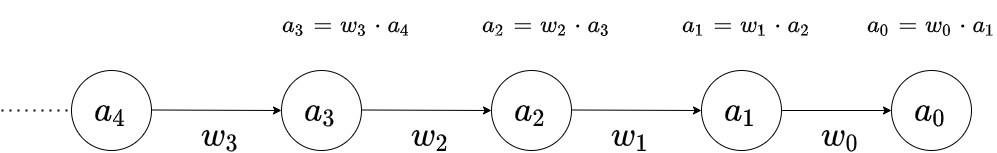

# Backpropagation im mehrlagigen neuronalen Netze


In Anlehnung ans das Video "The Absolutely Simplest Neural Network Backpropagation Example" von 
Mikael Laine [^1], ist hier eine Erklärung, wie die Backpropergation in einem sehr einfachen neuronalen Netz funktioniert. Zuerst wird gezeigt, wie es mit zwei Knoten funktioniert und dann wird der Backpropergation-Algorithmus auf ein Mehrlagenlayer-Netz ausgeweitet.

Im ersten Fall besteht das neuronale Netz nur aus einem Input-Layer Knoten (i) und einen Output-Layer Knoten (a).

<p>

</p>

Wir wollen nun zeigen, wie das Netz, durch anpassen der Gewichte, trainiert wird, um einen bestimmeten Ausgangswert zu erreichen.<br>
Ziel ist es, den Wert vom Knoten (a) auf 0,5 zu tranieren, wenn der Eingangswert bei 1,5 ist.

Das Gewicht (w) wird mit einem Zufallswert initialiersiert. z.B. 0,8


| input (i) | Gewünschter Output  | output (a) |
| ----------| --------------------|------------|
|  1,5      |  0,5                |  1,2       |


$a$= $i$ * $w$ = 1,5 * 0,8 

Als Fehlerfunktion C am Ausgang wird der quadratische Fehler genommen: $c$ = $(a-y)^2$

<p>

</p>


Die Fehlerfunktion wird auch Kostenfunktion genannt $C$ 

$C(a)$ = $(a-y)^2$

$a(w)$ = $i$ * $w$

<!--

daraus folgt:

$C(a)$ =  $( i*w-y)^2$
-->


----
Einschub: Kettenregel

<p>

</p>

Dieses Bild kann als folgende Funktion geschrieben werden:

$Y(x)$ = $f(a_0 (a_1$(x) ) 

Anwendung der Kettenregel:

$\large \frac{\partial {Y}}{\partial x} = \frac{\partial {f(a_0(a_1(x))}}{\partial x} = \frac{\partial {a_0}}{\partial x} * \frac{\partial {Y}}{\partial a_0}$

-----

Angewendet auf unser Netzwerk:

$\large \frac{\partial {y}}{\partial a}= \frac{\partial {a}}{\partial w} * \frac{\partial {C}}{\partial a}$ 

Um sich langsam an den Wert für das Gewicht anzunähern, wird eine Lernrate $r$ eingeführt.
Updaten der Gewichte mit der Lernrate $r$ 

$\large w' = w - r *  \frac{\partial {C}}{\partial w}$ 


$\large w' = w - r * \frac{\partial {a}}{\partial w} * \frac{\partial {C}}{\partial a}$ 

mit 

$\large \frac{\partial {C}}{\partial a} = \frac{\partial }{\partial w} (a-y)^2 = 2(a - y)$

und

$\large \frac{\partial {a}}{\partial w} = \frac{\partial ({w * i})}{\partial w} = i$

ergibt sich:

$w$' = $w$ - r *  $i$ * 2($a$ - y)

Jetzt können wir das Gewicht so lange anpassen, bis das Gewicht sich auf einen Wert angenähert hat.

Beispiel in Python
```python

#Random Values
a= 0.1
w= 0.1

#Input = 1.5
i= 1.5

#Lernrate
r = 0.1

#Zielwert y = 0.5

y=0.5

for x in range (0,15):
    a=w * i  
    w=w-r*i*2*(a-y)

``` 

Output

```
W0 =   0.2050 Fehler =  -0.1925
W0 =   0.2628 Fehler =  -0.1059
W0 =   0.2945 Fehler =  -0.0582
W0 =   0.3120 Fehler =  -0.0320
W0 =   0.3216 Fehler =  -0.0176
W0 =   0.3269 Fehler =  -0.0097
W0 =   0.3298 Fehler =  -0.0053
W0 =   0.3314 Fehler =  -0.0029
W0 =   0.3323 Fehler =  -0.0016
W0 =   0.3327 Fehler =  -0.0009
W0 =   0.3330 Fehler =  -0.0005
W0 =   0.3332 Fehler =  -0.0003
W0 =   0.3332 Fehler =  -0.0001
W0 =   0.3333 Fehler =  -0.0001
W0 =   0.3333 Fehler =  -0.0000

```
Durch das schrittweise Anpassen, wird das Gewicht "gelernt".


****Neuronales Netz mit mehreren Schichten****


Jetzt sehen wir uns ein Netz mit drei Schichten an:

<p>

</p>


daraus ergibt sich für y die folgende Funktion:

y= $f(a_0 (a_1 (a_2$(x) ) ) )

Für die Backpropergation ergibt sich unter Einbeziehung der Kettenregel folgende partielle Differentailgleichung

$\large \frac{\partial}{\partial x} y= f(a_0 (a_1 (a_2(x) ) ) )
) )  =  \frac{\partial {a_2}}{\partial x} * \frac{\partial {a_1}}{\partial a_2} * \frac{\partial {a_0}}{\partial a_1} * \frac{\partial {Y}}{\partial a_0}$


somit ergibt sich für $w_1$

$\large w_1 = w_1 - r * \frac{\partial {a_1}}{\partial w_1} * \frac{\partial {a_0}}{\partial a_1} * \frac{\partial {C}}{\partial a_0}$ 

wobei

$\large \frac{\partial {C}}{\partial a_0} = 2(a_0 - y)$

$\large \frac{\partial {a_0}}{\partial a_1} = \frac{\partial ({w_0 * a_1})}{\partial a_1} = w_0$

$\large \frac{\partial {a_1}}{\partial w_1} = \frac{\partial ({w_1 * a_2})}{\partial w_1} = a_2$  

$\Rightarrow$

$\large w_1' = w_1 - r *  a_2 * w_0 * 2(a_0 - y)$

```python
#learing rate
r = 0.1

#Input
a2=1.5

#Random Values
w0 = 0.1
w1 = 0.1
a0 = 0.1
a1 = 0.1

#Zielwert y = 0.5
y=0.5

for x in range (0,35):
    a0=a1*w0   
    w0=w0-r*a1*2*(a0-y) 
    
    a1 = w1*a2
    w1=w1-r * a2*w0*2*(a0-y)
   

```

Output

```
W0 =   0.1098  W1 =   0.1161    Fehler =  -0.4900
W0 =   0.1243  W1 =   0.1342    Fehler =  -0.4835
W0 =   0.1410  W1 =   0.1544    Fehler =  -0.4783
W0 =   0.1600  W1 =   0.1770    Fehler =  -0.4716
W0 =   0.1814  W1 =   0.2022    Fehler =  -0.4630
W0 =   0.2054  W1 =   0.2301    Fehler =  -0.4518
W0 =   0.2320  W1 =   0.2605    Fehler =  -0.4377
W0 =   0.2609  W1 =   0.2934    Fehler =  -0.4200
.
.
.
W0 =   0.5544  W1 =   0.6005    Fehler =  -0.0014
W0 =   0.5545  W1 =   0.6006    Fehler =  -0.0009
W0 =   0.5546  W1 =   0.6007    Fehler =  -0.0005
W0 =   0.5547  W1 =   0.6008    Fehler =  -0.0003
W0 =   0.5547  W1 =   0.6008    Fehler =  -0.0002
W0 =   0.5547  W1 =   0.6008    Fehler =  -0.0001
W0 =   0.5547  W1 =   0.6008    Fehler =  -0.0001
W0 =   0.5547  W1 =   0.6009    Fehler =  -0.0000

Check 0.499
```

Jetzt kann es für weitere Schichten einfach erweitert werden

<p>

</p>

somit ergibt sich:

$\large y= f(a_0 (a_1 (a_2 (a_3(x) ) ) ) )$

$\large \frac{\partial}{\partial x} f(a_0 (a_1 (a_2 (a_3(x) ) ) ) ) =  \frac{\partial {a_3}}{\partial x} * \frac{\partial {a_2}}{\partial a_3} * \frac{\partial {a_1}}{\partial a_2} * \frac{\partial {a_0}}{\partial a_1} * \frac{\partial {f}}{\partial a_0}$

$w_0$ und $w_1$ wurden ja schon berechnet.

$\large w_2' = w_2 - r * \frac{\partial {a_1}}{\partial w_2} * \frac{\partial {a_1}}{\partial a_2} * \frac{\partial {a_0}}{\partial a_1} * \frac{\partial {C}}{\partial a_0}$ 


$\large \frac{\partial {a_1}}{\partial a_2} = \frac{\partial ({w_1 * a_2})}{\partial a_2} = w_1$

$\large \frac{\partial {a_1}}{\partial w_2} = \frac{\partial ({w_2 * a_3})}{\partial w_2} = a_3$


$\large w_2' = w_2 - r *  a_3 * w_1 * w_0 * 2(a_0 - y)$


$\large w_3' = w_3 - r * \frac{\partial {a_3}}{\partial w_3} * \frac{\partial {a_2}}{\partial a_3} * \frac{\partial {a_1}}{\partial a_2} * \frac{\partial {a_0}}{\partial a_1} * \frac{\partial {C}}{\partial a_0}$ 

$\large \frac{\partial {a_2}}{\partial a_3} = \frac{\partial ({w_2 * a_3})}{\partial a_3} = w_2$

$\large \frac{\partial {a_3}}{\partial w_3} = \frac{\partial ({w_3 * a_4})}{\partial w_3} = a_4$

$\large w_3' = w_3 - r *  a_4 * w_2 * w_1 * w_0 * 2(a_0 - y)$

```python
#learing rate
r = 0.1

#Input
a4=1.5

#Random Values
w0 = 0.1
w1 = 0.1
w2 = 0.1
w3 = 0.1

a0 = 0.1
a1 = 0.1
a2 = 0.1
a3 = 0.1

#Zielwert y = 0.5

y=0.5

for x in range (0,400):
    
    #Vorwaertspfad
    a0 = w0 * a1   
    a1 = w1 * a2
    a2 = w2 * a3
    a3 = w3 * a4
    
    #Berechnung der Gewichte
    w0=w0-r*a1*2*(a0-y) 

    w1=w1-r*a2*w0*2*(a0-y)
    
    w2=w2-r*a3*w1*w0*2*(a0-y)
    
    w3=w3-r*a4*w2*w1*w0*2*(a0-y)


```
Output

```
W0 =   0.1010  W1 =   0.1001  W2 =   0.1001  W3 =   0.1001    Fehler =  -0.4900
W0 =   0.1011  W1 =   0.1003  W2 =   0.1003  W3 =   0.1003    Fehler =  -0.4990
W0 =   0.1012  W1 =   0.1004  W2 =   0.1004  W3 =   0.1004    Fehler =  -0.4999
.
.
.
W0 =   0.7251  W1 =   0.7546  W2 =   0.7546  W3 =   0.7546    Fehler =   0.0004
W0 =   0.7251  W1 =   0.7546  W2 =   0.7546  W3 =   0.7546    Fehler =   0.0002
W0 =   0.7251  W1 =   0.7546  W2 =   0.7546  W3 =   0.7546    Fehler =   0.0001
W0 =   0.7251  W1 =   0.7546  W2 =   0.7546  W3 =   0.7546    Fehler =  -0.0000

Check 0.4999999979013684


```


[^1]: https://www.youtube.com/watch?v=8d6jf7s6_Qs
